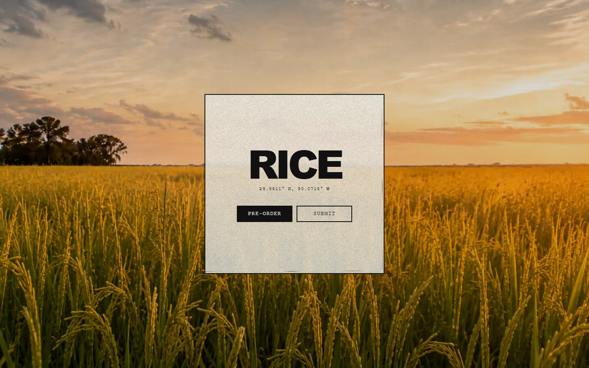
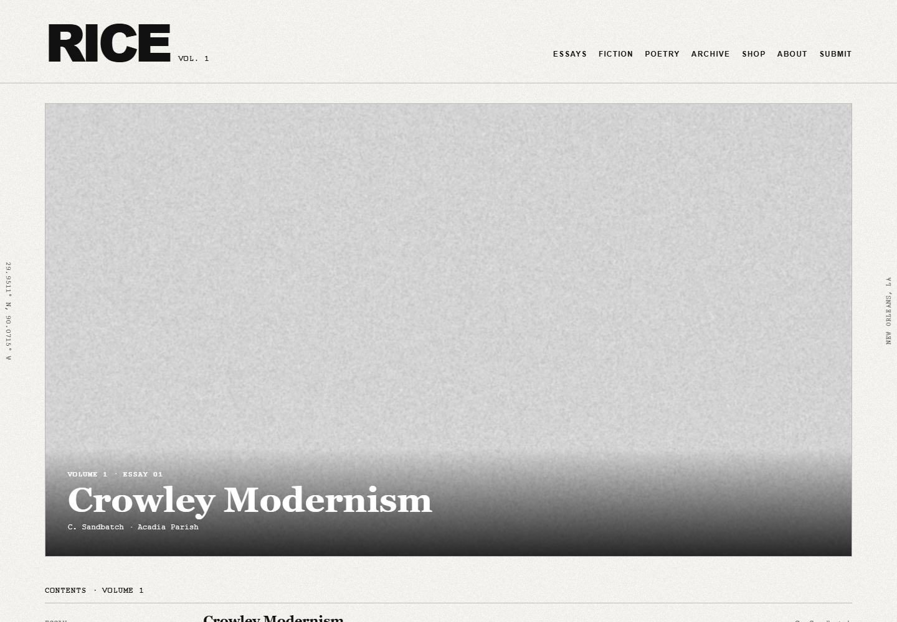
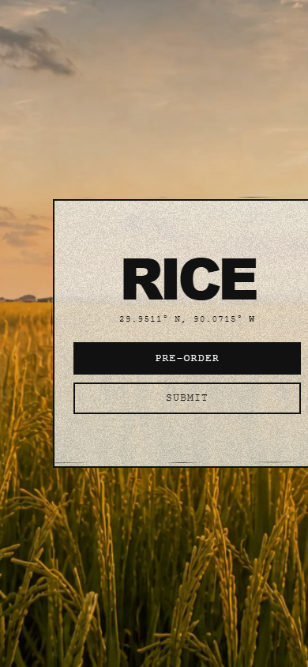
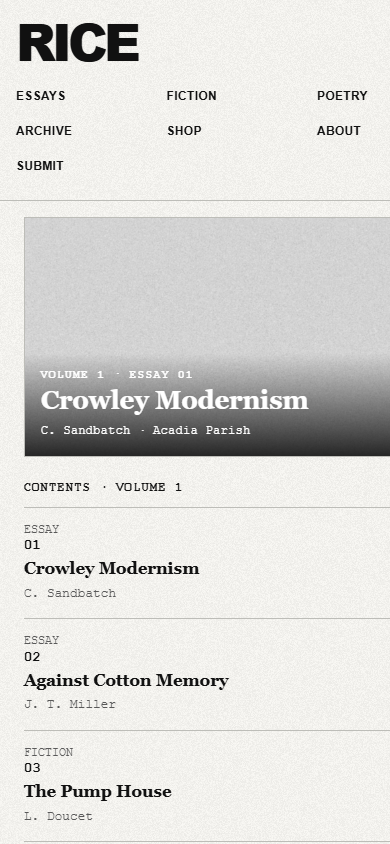
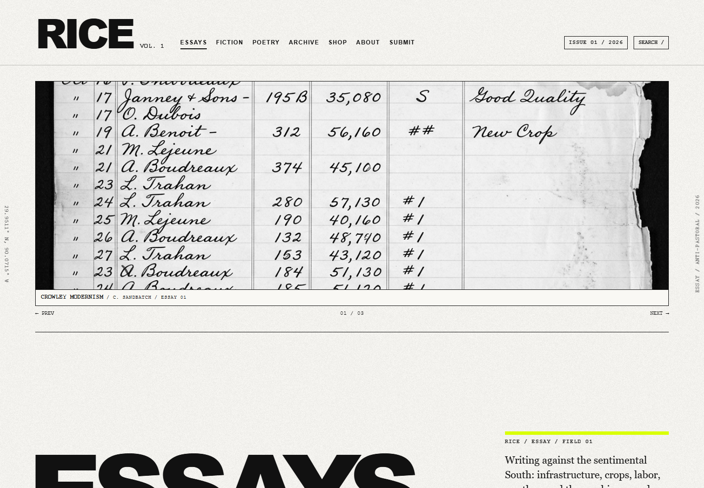
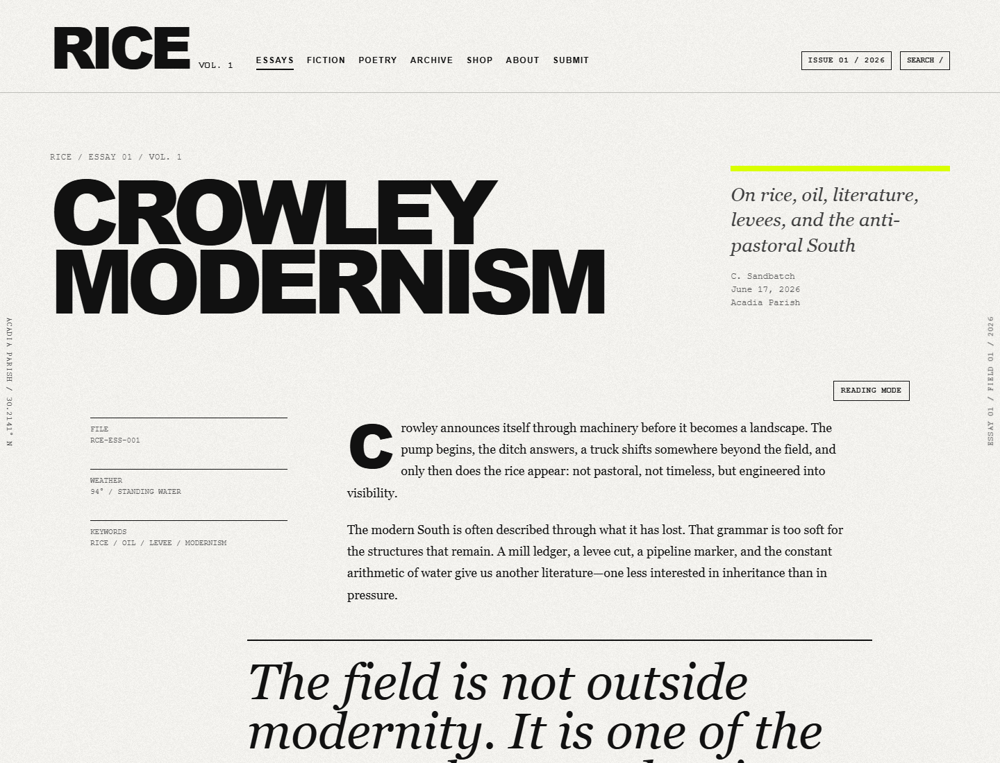
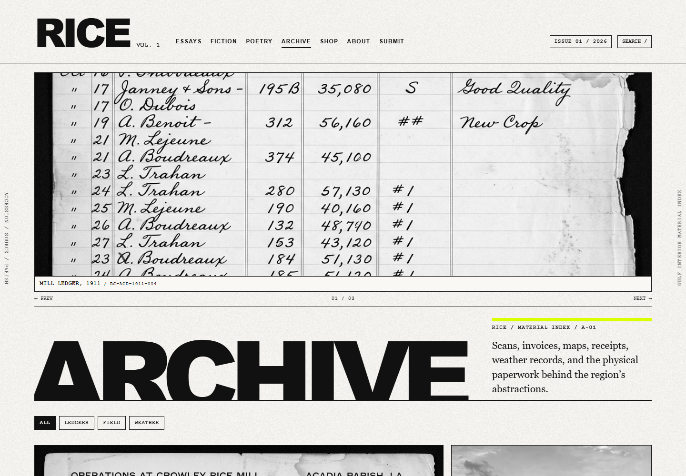
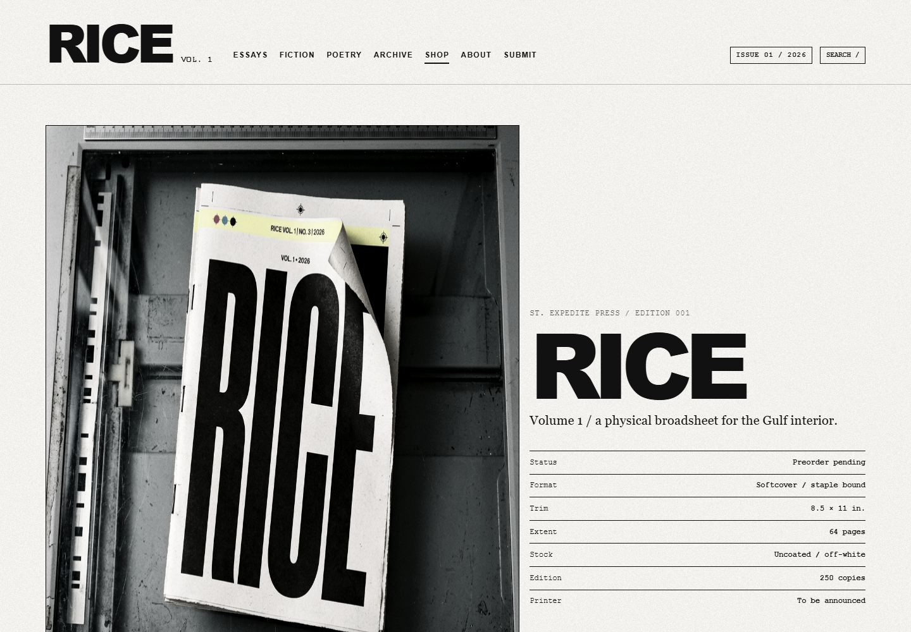

# RICE Magazine

RICE is an independent literary magazine of essays, fiction, poetry, and archival work from the Gulf South. This repository contains the magazine’s static website and the design system for its first volume.



## About

RICE is a Southern literary magazine informed by post-alt-lit, C86 zine culture, and retro modernist aesthetics.

Rooted in New Orleans, RICE publishes essays, fiction and poetry by writers who explore the unique texture of the Gulf South while looking outward to broader cultures and movements.

We believe that literary publications should be both severe and welcoming: our pages are spare but alive with thought. We value work that resists nostalgia, embraces the present moment, and experiments with form.

Founded by [St. Expedite Press](https://stexpedite.press), RICE functions as a broadsheet companion to our more devotional and archival projects.

## The project

The site treats the web edition as a piece of printed matter: a strict editorial grid, heavy grotesque masthead, serif reading typography, monospace metadata, photocopied grain, and restrained black rules. New Orleans coordinates run through the identity as a quiet geographic colophon.

The splash page pairs a distressed paper panel with an ambient, image-generated rice-field loop. The main issue expands into oversized section indexes, asymmetric reading pages, marginal notes, pull quotes, a freeform poetry stage, a filterable archive, a submission call sheet, a manifesto, and a physical-edition specimen.

The design is intentionally lightweight and framework-free. It uses semantic HTML, a shared stylesheet, and a small dependency-free interaction layer for issue search, archive filters, image zoom, and reading mode. Responsive layouts, keyboard focus states, reduced-motion support, and poster-image fallback remain built in.

## Screens

| Desktop issue page | Mobile splash |
| --- | --- |
|  |  |

### Mobile issue page



### Editorial system

| Essay index | Reading page |
| --- | --- |
|  |  |

| Archive index | Physical issue specimen |
| --- | --- |
|  |  |

## Site structure

- `splash.html` — ambient entrance page with preorder and submission actions
- `index.html` — Volume 1 cover and table of contents
- `essays.html`, `fiction.html`, `poetry.html` — section landing pages
- `essay-template.html`, `fiction-template.html`, `poem-template.html` — editorial templates
- `archive.html`, `archive-template.html` — archival material and field-card format
- `about.html`, `submissions.html`, `shop.html` — magazine information and calls to action
- `styles.css` — shared visual system and responsive behavior
- `site.js` — search, reading mode, archive filters, zoom, and form states
- [`docs/IMAGE_STYLE_GUIDE.md`](docs/IMAGE_STYLE_GUIDE.md) — C86 × South × St. Expedite Press image direction, prompt presets, and archive ethics

## Local preview

Serve the repository with any static web server:

```sh
python -m http.server 4173
```

Then open:

- `http://localhost:4173/splash.html`
- `http://localhost:4173/index.html`

## Publisher

[St. Expedite Press](https://stexpedite.press) · New Orleans, Louisiana  
29.9511° N, 90.0715° W
